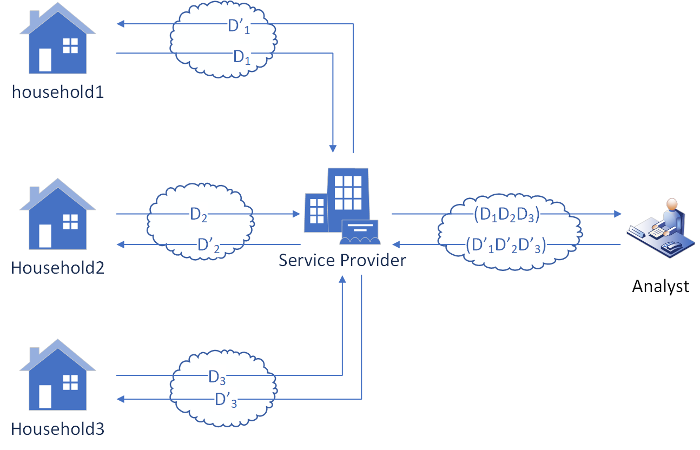

# Introduction

This is the code for protecting privacy using selective homomorphic encryption via Lattigo Library.
The core idea is to find out which sections of data should be encrypted based on the metric of entropy.

<p align="center">
	
</p>

The smart metering system mode is simplified. There is multiple clients but one central server, as well as third-party analysts. Also, for the safe distribution of HE keys, Certificate Authority will be applied. And the code is to show how to use selective encryption for the balance of data privacy and system performance.

The proprocessed data has been put into the example\dataset folder.

The code is running on Windows platform, and not tested on Linux or Mac.

### Testing performance among different block size choices
```bash
$ go run .\blocksize_choices\test_blocks.go
```

### Testing privacy metrics based on entropy
```bash
$ go run .\privacy_metrics\test_metrics.go
```

### Testing attack success rate based on entropy
```bash
$ go run .\asr\test_asr.go 1 2 0 1 60 80
```
Params meaning: strategy, dataset, uniqueATD, target, encryptionRatio, maxHouseholdsNumber
